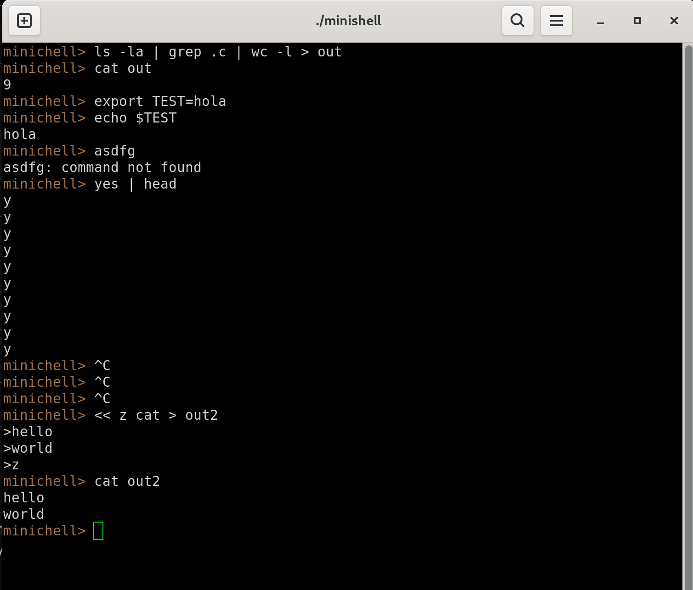

# 🐚 Minishell - As beautiful as a shell can be

> "Writing your own shell is the best way to understand how your OS really talks to you."

[](https://en.wikipedia.org/wiki/C_(programming_language))
[](https://www.gnu.org/software/bash/)
[](https://42.fr/)

## 🚀 Introduction

Minishell is a simplified (yet robust) recreation of the Bash shell. This project is not just about parsing commands, but about understanding and manipulating system processes, memory management, and file descriptors at a low level using the Unix C API.

The goal: to create a functional shell capable of executing commands, handling pipes, redirections, and signals, **with zero memory leaks**.

---

## 📸 Demo in Action



---

## ✨ Implemented Features

| Category | Functionalities |
| :--- | :--- |
| **Command Execution** | Execution of binaries (e.g., `/bin/ls`) and `PATH` commands. |
| **Built-ins** | Custom implementation of `echo`, `cd`, `pwd`, `export`, `unset`, `env`, `exit`. |
| **Redirections** | Input (`<`), Output (`>`), Append (`>>`), and Here-Doc (`<<`). |
| **Pipes** | Infinite pipes (`cmd1 | cmd2 | cmd3 ...`). |
| **Signals** | Proper handling of `Ctrl-C` (SIGINT), `Ctrl-\` (SIGQUIT), and `Ctrl-D` (EOF). |
| **Parsing** | Handling of single (`' '`) and double (`" "`) quotes and variable expansion (`$VAR`). |
| **Memory** | Rigorous management. Zero leaks verified with Valgrind. |

---

## 🧠 Technical Challenges

The most complex part of this project wasn't what you see, but what happens under the hood:

* **Parent/Child Architecture:** Intensive use of `fork()` to create subprocesses and `execve()` to convert them into new programs.
* **File Descriptor Management:** Use of `dup2()` and `pipe()` to redirect `STDIN` and `STDOUT` between processes without losing control of the terminal.
* **Signal Handling:** Preventing the shell from closing when a child process receives an interrupt signal, distinguishing between interactive and execution modes.

---

## 🛠️ Installation & Usage

```bash
# 1. Clone the repository
git clone [https://github.com/grabier/minishell.git](https://github.com/grabier/minishell.git)

# 2. Enter the directory
cd minishell

# 3. Compile (ensure readline is installed)
make

# 4. Run
./minishell
